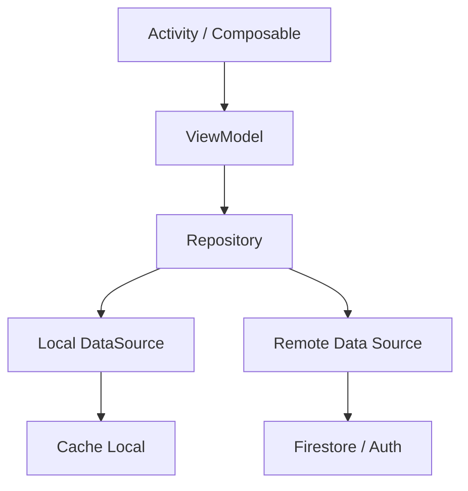

# TPDesarrolloAplicaciones1
SafeWalk – Aplicación móvil de rutas seguras para peatones

SafeWalk es una aplicación móvil desarrollada en Kotlin + Jetpack Compose cuyo objetivo es ayudar a los peatones a caminar de forma más segura.
Permite visualizar la seguridad de cada tramo urbano, reportar calles inseguras y planificar rutas basadas en información real aportada por la comunidad.

## Características principales
## Mapa de seguridad

Visualización de tramos seguros, dudosos y peligrosos mediante colores:

🟢 Verde: seguro

🟠 Naranja: inseguro

🔴 Rojo: muy peligroso

Mapa actualizado con reportes en tiempo real.

##Reportes colaborativos

- Calificación de 1 a 5 estrellas.

- Comentarios descriptivos.

- Adjuntar fotos desde la cámara o galería.

- Guardado en Firebase Firestore y Firebase Storage.

## Perfil del usuario

- Foto de perfil editable.

- Historial de reportes realizados (CRUD).

- Posibilidad de editar o eliminar reseñas.

## Autenticación

- Registro con correo y contraseña.

- Inicio de sesión.

- Recuperación de contraseña mediante Firebase Auth.

## Tema claro y oscuro

- Interfaz totalmente adaptada para modo light/dark.


## Inicio Rapido

**Prerequisitos:** Android Studio 

```bash
# clonar el repo
git clone https://github.com/TU-USUARIO/SafeWalk.git

# sincronizas las dependencias
File -> Sync Project with Gradle Files

# Ejecutar
Elegis un emulador o dispositivo fisico y presionas Run ▶️
```

## Arquitectura
### Arquitectura de alto nivel



